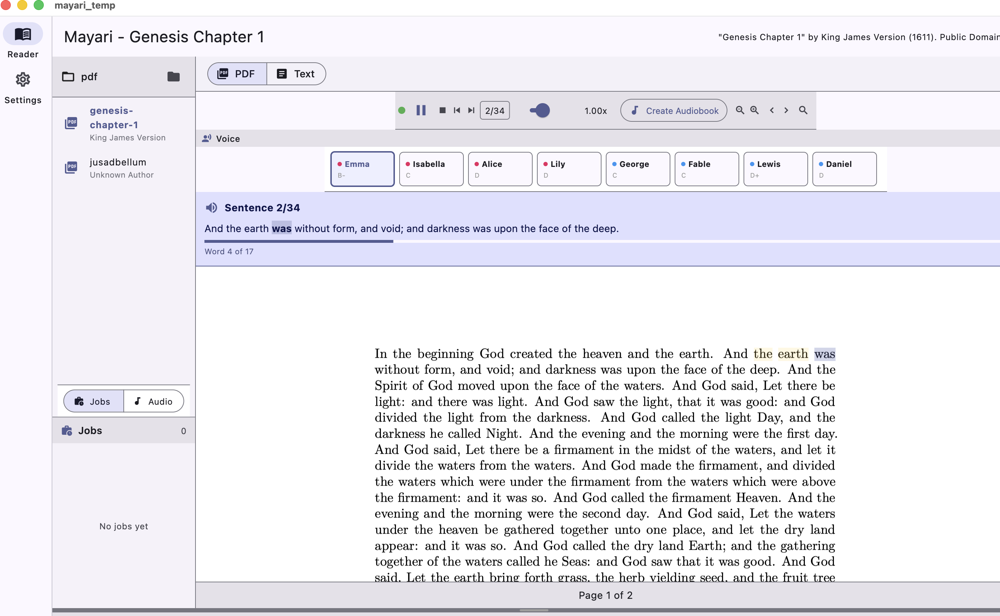

# Mayari Website

License: Source code is licensed under Business Source License 1.1 (BSL-1.1), and binary distributions are licensed under the Mayari Binary Distribution License. See [LICENSE](LICENSE), [BINARY-LICENSE.txt](BINARY-LICENSE.txt), and the [website License page](license.html).

The codebase is cross-platform, but we currently provide macOS binaries only.

## Latest Download

- DMG: https://github.com/BoltzmannEntropy/Mayari/releases/download/v1.0.2/Mayari-1.0.2.dmg

## Latest App Screenshot

## Stars

